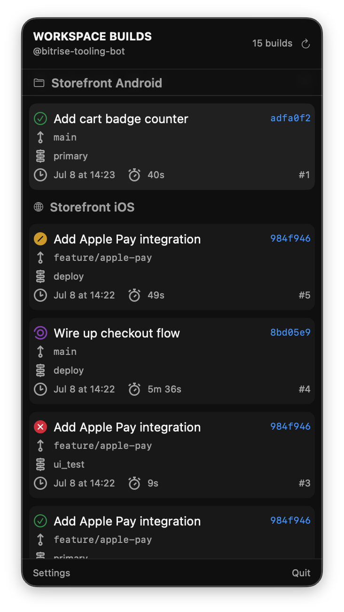

# Bitrise Desktop App

A native macOS menu bar app that shows the live status of your Bitrise CI builds, so you can glance at the menu bar instead of opening a browser tab or waiting for a Slack ping.

> This repository hosts the **downloads and issue tracker** for the app.

  

## Download

**[Download the latest release](https://github.com/bitrise-io/bitrise-desktop-app/releases/latest)** and grab the `Bitrise-<version>.dmg` asset.

## Installation

1. Open the downloaded `.dmg`.
2. Drag **Bitrise** onto the **Applications** folder.
3. Launch **Bitrise** from Applications.

On first launch macOS may ask you to confirm opening an app downloaded from the internet, click **Open**.

The app lives in your menu bar only, there is no Dock icon.

## Requirements

- macOS 14.6 (Sonoma) or later.

## What it does

- **Live build status in the menu bar.** The icon reflects the most recently started build across the projects you watch: passed, failed, running, or aborted.
- **A unified build list per workspace.** Subscribe to the projects you care about and see their builds in one place, each filtered by the branches you choose.
- **One-click deep links.** Jump straight from a build row to the build on Bitrise, or to the related pull request or commit.
- **Per-project notifications.** Choose per project whether to be notified on every completion, on failures only, or not at all, behind a global on/off switch.
- **Local-directory tracking.** Point the app at a local checkout and it follows the branch you have checked out, matching your working repo to its Bitrise project.

The app is read-only: it shows build status but does not trigger or rebuild.

## Getting started

1. Launch the app and click the menu bar icon.
2. Click **Connect to Bitrise** and sign in through your browser.
3. Pick the workspace you want to follow.
4. Open **Settings > Projects** and subscribe to the projects you want to watch, either directly or by pointing the app at a local checkout. Your build list fills in as their builds come in.

<!-- TODO(before public): link the DevCenter guide once published. -->

## Updating

The app checks for newer releases periodically and on demand (**Check Now** in **Settings > About**). When an update is available it points you here to download the new `.dmg`, which you install the same way as the first time.

## Reporting issues

Found a bug or have a feature request? [Open an issue](https://github.com/bitrise-io/bitrise-desktop-app/issues). Please include your app version (**Settings > About**) and your macOS version.

For account or CI questions unrelated to the app, contact [Bitrise support](https://bitrise.io).

## Privacy

The app sends product-usage analytics to Bitrise, tied to your Bitrise account, to help us improve it.

## Licence

The Bitrise Desktop App is proprietary software and is not open source. See [LICENCE](LICENCE) for the terms under which you may install and use it.
